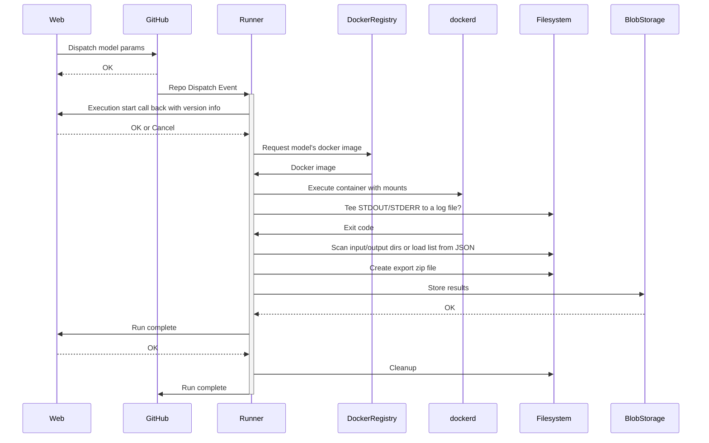

# Model Execution Architecture

## Running a model

### Execution flow

  
Sequence Diagram Source

### API

The current API takes the form of a JSON input and output schema that is used to pass data from the web application to the model runner, and subsequently the models themselves. Its current incarnation lives in [`packages/api`](packages/api).

### Control Plane

A control plane is a GitHub repository that houses the workflow and other associated files needed to run the models. It may also have custom runner registered in order to provide more model specific hardware.

- An Actions workflow in control-plane repo executes model runner with input from the [repository dispatch event](https://help.github.com/en/actions/reference/events-that-trigger-workflows#external-events-repository_dispatch).
- The workflow matrixs out the list of models to execute into individual jobs that call the model runner.

### Model Runner

The model runner is a thin bit of wrapper code who's primary responsibility is communicating execution state to the frontend via a callback URL that is provided as part of the input.

Responsibilities:

- Communicating state to the frontend.
- Executing a [very particular](adding-models.md#docker-image) kind of Docker image/container.
- Input validation.
- Minimal generic output processing (i.e. export zip)
- Uploading artifacts to storage.

## Connectors

Connectors provide the glue code, needed for executing a specific model in this system. They need to do a transformation from our standard input format into the inputs that the model expects, either in configuration files on via the CLI. This code is also be responsible for the actual execution of the model itself. Finally, it must transform the output of the execution into the standard output format that we expect.

This code is managed independently of the model runner, either by the modeling team, or the open source community. It should wrap the published model artifact (Docker image or otherwise), and produce a Docker image matching a [very specific format](adding-models.md#docker-image), that can be executed directly.
