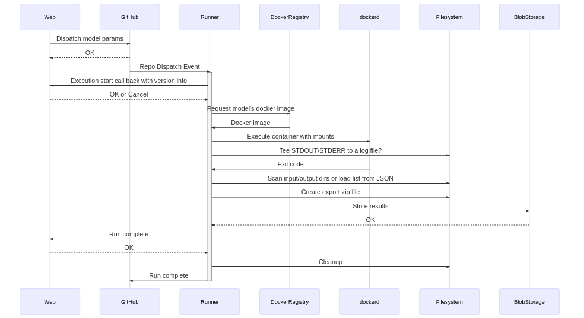
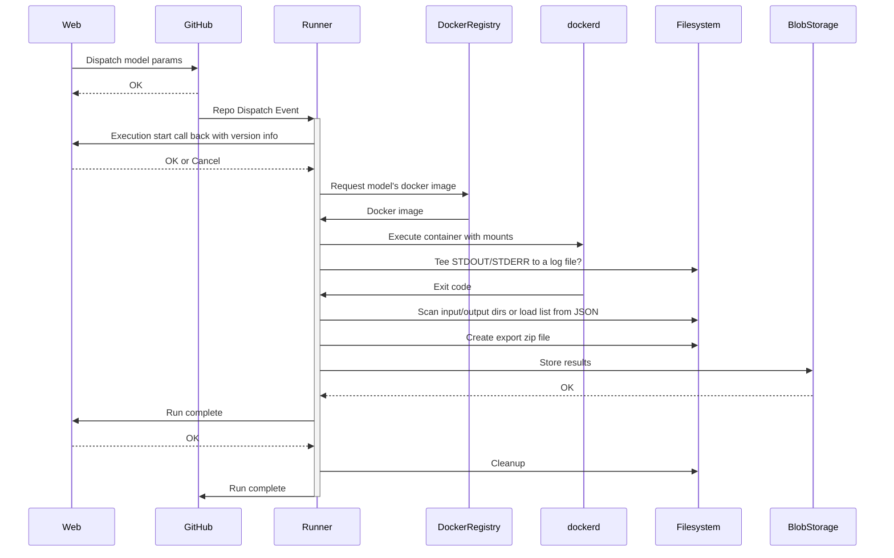

# Open Source Model Execution Architecture

## API

We need to establish and publish a clear API contract for the **inputs** that we plan to make available ot the models, and the **outputs** that we expect to receive back from them. Each model will be responsible for conforming to this contract.

This API is also used to pass data from the web application to the model runner. Its current incarnation lives in the model-runner repo under `api`. But it would likely be better to move this out into a shared library prior to open sourcing as it will need to be shared by multiple parties and is independent of any given implementation.

## Running a model

### Execution flow

  
Sequence Diagram Source

### Assumptions

* Workflow in control-plane repo executes model runner with input from the repository dispatch event.
* Model runner executes a Docker image the conforms to our execution API and includes any connectors required in addition to the model code and base data.
* Model image logs to STDOUT.
* Model image returns a status code when completed.
* Model runner looks for output file that lists inputs/outputs from the model?

## Model runner v2

The more generic next version of the model runner should only be responsible for:

* Communicating with the frontend.
* Knowing which version of each model to execute?
  * It may be that we actually want to manage this in the web app? Perhaps via an admin UI or something?
* Executing a very particular kind of Docker image/container.
* Input/Output validation?
* Minimal generic output processing (i.e. export zip)
* Uploading artifacts to storage.

## Connector

Every model will likely need some glue code, which we will call a connector. It will need to do a transformation from our standard input format into the inputs that the model expects, either in configuration files on via the CLI. This code will also be responsible for the actual execution of the model itself. It will also need to transform the output of the execution into the standard output format that we expect.

This code will be manage independently of the model runner, either by the modeling team, or the open source community. It should wrap the published model artifact (Docker image or otherwise), and produce a Docker image matching a very specific format, that can be executed directly. Ideally we can take our learning from the first two models and produce an example repo or SDK for building a connector.

## Docker Image Requirements

* `ENTRYPOINT` or `CMD` are specified in such a way that the container can be executed with no special arguments or other knowledge.
* All input data is copied to or stored in `/data/input` (this will be volume mounted into the container).
* All output data is copied to or stored in `/data/output` (this will be volume mounted into the container).
* All logs are copied to or stored in `/data/log` (this will be volume mounted into the container).
* A JSON file with a specific format documenting: command executed (with arguments), inputFiles, outputFile, version, etc is written to `/data/metadata.json`?
